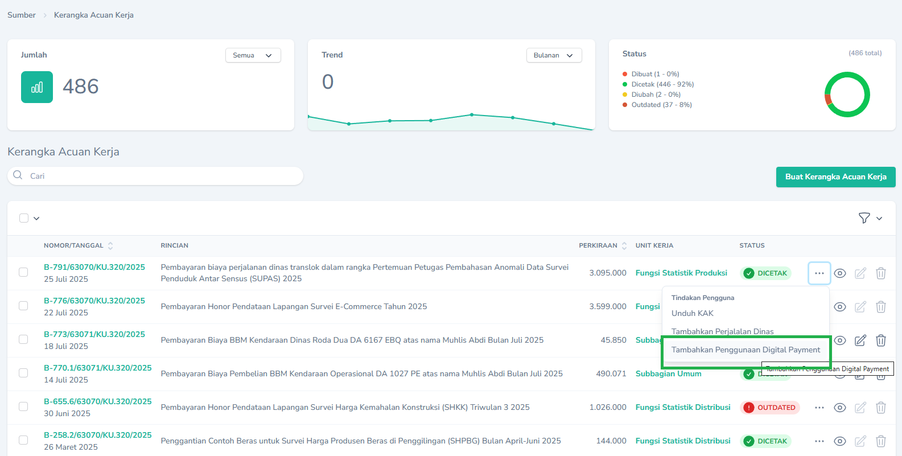
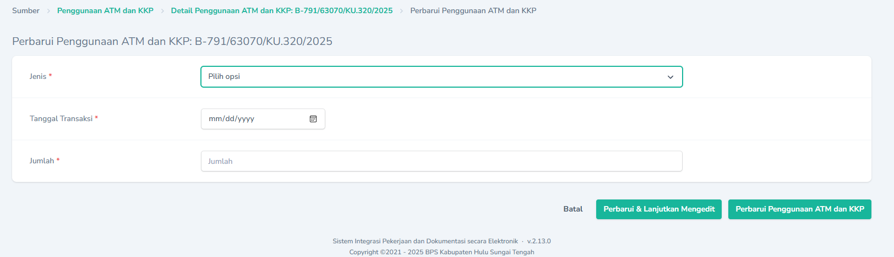
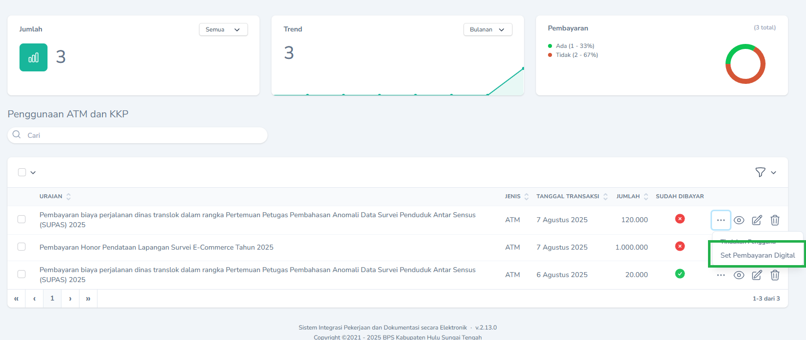
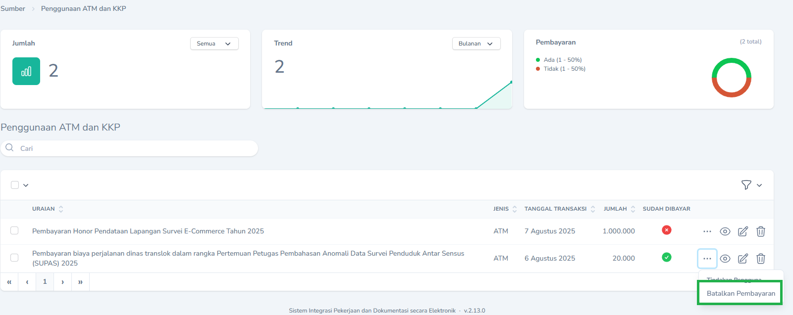

## Transaksi yang wajib dicatat

Transaksi yang wajib dilakukan pencatatan adalah:

1. Semua Transaksi yang Menggunakan KKP (Kartu Kredit Pemerintah)
2. Transaksi menggunakan ATM atau CMS yang pembayarannya dilakukan sebelum lengkap SPJ nya (Misal pembayaran cetak spanduk, pembelian barang menggunakan ATM Bendahara)

## Membuat

Daftar Penggunaan KKP dan ATM bisa ditambahkan melalui menu `Kerangka Acuan Kerja`. Untuk menambahkan Penggunaan KKP dan ATM, pada `Halaman Indeks` Kerangka Acuan, klik `Tombol Aksi` dan pilih `Tambahkan Penggunaan Digital Payment`.

<Frame caption="Tampilan Menambahkan Penggunaan KKP dan ATM">
  
</Frame>

Selanjutnya silakan ubah rincian jenis penggunaan, tanggal transaksi dan jumlah.

<Frame caption="Tampilan Mengubah Penggunaan KKP dan ATM">
  
</Frame>

## Mencatat Pembayaran
<Warning>
  Menu ini hanya dapat diakses oleh Pejabat Pembuat Komitmen dan PPSPM
</Warning>
Untuk mencatat pembayaran bisa dilakukan melalui `Halaman Indeks` ,`Penggunaan ATM dan KKP` lalu pilih aksi `Set Pembayaran Digital`
<Frame caption="Tampilan Mencatat Pembayaran Penggunaan KKP dan ATM">
  
</Frame>
<Tip>
  Jika ingin mengubah status bayar menjadi belum, dapat dilakukan dengan memilih Aksi `batal Pembayaran`
  <Frame caption="Tampilan Membatalkan Pencatatan Pembayaran Penggunaan KKP dan ATM">
  
</Frame>
</Tip>
## Mengubah

Untuk mengubah penggunaan KKP dan ATM dapat dilakukan dengan cara mengklik `Tombol Sunting` pada record yang akan diubah.

## Menghapus

Untuk menghapus penggunaan KKP dan ATM dapat dilakukan dengan cara mengklik `Tombol Hapus` pada record yang akan dihapus.