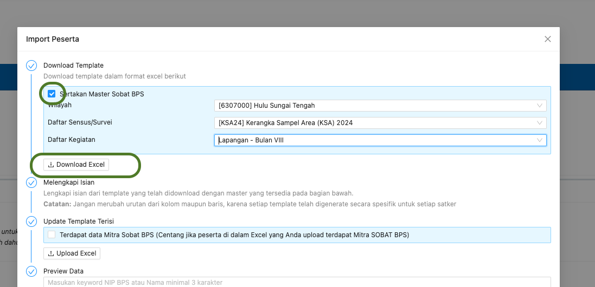

## Membuat

Untuk membuat Rekapitulasi Pulsa Kegiatan dapat dilakukan melalui menu `Manajemen`, lalu pilih menu `Pulsa Kegiatan`. Untuk menambahkan daftar baru, buka Halaman Indeks dan klik tombol `Buat Pulsa Kegiatan` yang terdapat di bagian kanan tabel.

<Frame caption="Tampilan Menambahkan Pulsa Kegiatan">
  
</Frame>

## Menambahkan Daftar Penerima Pulsa

### Menambahkan Secara Langsung

Penambahan Daftar Mitra Penerima Pulsa dapat dilakukan melalui `Halaman Detail` Pulsa Kegiatan dan memilih aksi `Tambah` pada tab `Daftar Pulsa Mitra`.

<Frame caption="Tampilan Penambahan Mitra Penerima Pulsa">
  
</Frame>

### Melalui Import Excel dari Aplikasi BOS

<Steps>
  <Step title="Download Template dari BOS">
    Masuk Aplikasi BOS, Pada Halaman Pembuatan Form Permintaan Honor, pilih tombol `Import Peserta`.

    <Frame caption="Tombol `Import Peserta` pada Aplikasi BOS">
      
    </Frame>
    Selanjutnya pilih tombol `Download Excel` untuk mendownload template excel yang akan diimport ke dalam aplikasi. Jangan lupa beri ceklis pada pilihan `Sertakan Master Sobat BPS`.

    <Frame caption="Tombol `Download Excel` pada Aplikasi BOS">
      
    </Frame>
  </Step>
  <Step title="Tambahkan Daftar Mitra Penerima Pulsa">
    Penambahan Daftar Mitra Penerima Pulsa dapat dilakukan melalui `Halaman Detail` tab `Daftar Pulsa Mitra` dan memilih aksi `Import dari BOS`.

    <Frame caption="Tombol Aksi `Import dari BOS`">
      
    </Frame>
    <Tip>
      Anda dapat menambahkan nilai default Volume, Nominal dan Harga Pulsa saat mengimport data dari BOS sehingga tidak perlu mengubah satu per satu daftar penerima pulsa yang ada. Cukup ubah yang berbeda dengan nilai default saja.

      <Frame caption="Menambahkan default Volume, Nominal dan Harga Pulsa">
        
      </Frame>
    </Tip>
  </Step>
</Steps>

## Membagikan Link Konfirmasi Nomor HP dan Bukti Penerimaan Pulsa

Agar nomor tujuan pengiriman pulsa tidak salah, mitra perlu melakukan konfirmasi nomor terlebih dahulu. Pengisian dapat dilakukan dengan membagikan tautan `Pulsa Kegiatan`. Tautan dapat disalin melalui `Halaman Indeks` pada daftar `Pulsa Kegiatan` dan mengklik `salin` pada kolom `Link Konfirmasi dan Upload`

<Frame caption="Tampilan Menyalin Tautan ">
  
</Frame>

<Warning>
  Masing-masing kegiatan punya tautan yang unik, pastikan tidak salah membagikan link.
</Warning>

<Warning>
  Link hanya berlaku apabila status `Pulsa Kegiatan` masih `open`. Jika status telah `selesai` dan masih perlu perbaikan, tautan harus dibuka terlebih dahulu melalui menu aksi `Buka Form`

  <Frame caption="Tampilan Buka Form">
    
  </Frame>
</Warning>

## Konfirmasi Nomor handphone Oleh Mitra

Konfirmasi nomor HP yang akan diisi pulsa dilakukan oleh mitra melalui link yang telah disediakan. Pilihan yang dipilih adalah `Konfirmasi Nomor Handphone` an mengisi data yang diperlukan sesuai petunjuk yang diberikan.

<Frame caption="Pilihan Konfirmasi Nomor Handphone">
  
</Frame>

## Upload Bukti Pulsa Masuk Oleh Mitra

Upload Bukti Pulsa masuk dilakukan oleh mitra melalui link yang telah disediakan. Pilihan yang dipilih adalah `Upload Bukti Pulsa Masuk` dan mengisi data yang diperlukan sesuai petunjuk yang diberikan.

<Frame caption="Pilihan Upload Bukti Pulsa Masuk">
  
</Frame>

## Mengubah

Untuk mengubah Honor Kegiatan dapat dilakukan dengan cara mengklik `Tombol Sunting` pada record yang akan diubah.

## Menghapus

Untuk menghapus Honor Kegiatan dapat dilakukan dengan cara mengklik `Tombol Hapus` pada record yang akan dihapus.

## Mencetak Daftar Pulsa

Pencetakan daftar pulsa bertujuan untuk memudahkan Pejabat Pengadaan untuk melakukan pengadaan Pulsa. Cukup unduh daftar pulsa untuk diserahkan ke penyedia. Untuk mengunduh daftar pengisian pulsa dapat dilakukan melalui tombol `Aksi` lalu pilih `Export Daftar Pulsa`

<Frame caption="Tampilan Cetak">
  
</Frame>

<Tip>
  Anda dapat mengganti nama file yang diunduh.
</Tip>

## Mencetak Tanda Terima Pulsa

Pencetakan Tanda Terima pulsa bertujuan untuk memudahkan dalam pemenuhan pertanggunjawaban Pengadaan Pulsa. Untuk mengunduh tanda terima pulsa dapat dilakukan melalui tombol `Aksi` lalu pilih `Unduh Tanda Terima Pulsa`

<Frame caption="Tampilan Cetak">
  
</Frame>
<Tip>
  Anda dapat mengganti nama file yang diunduh.
</Tip>